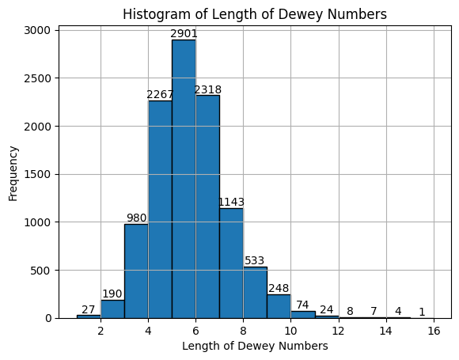
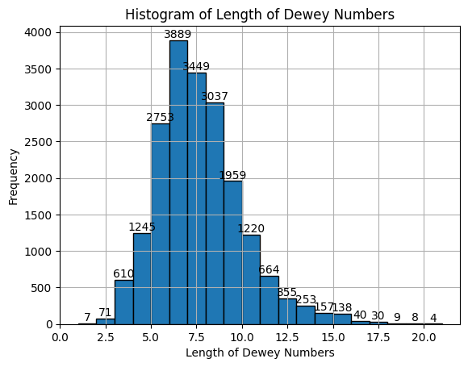
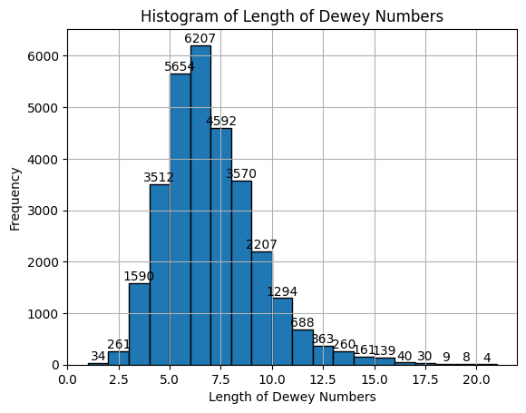
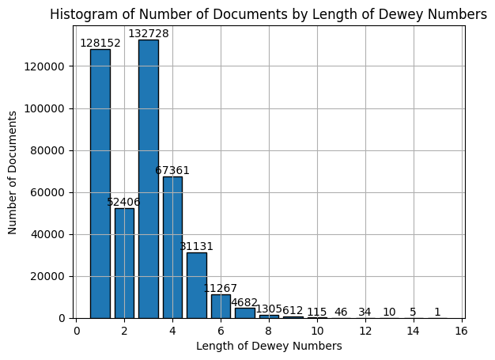
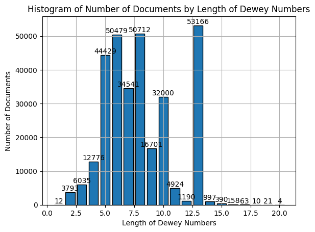
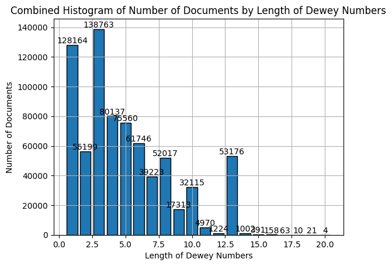

# Data Analysis of Knowledge Organization Systems (KOS)

## Project title
Data Analysis of Knowledge Organization Systems (KOS)

## Motivation
This project aims to analyze the terms data from the Universiteitsbibliotheek Gent (Gent University Library) and resolve them using open-source APIs to gain insights into the structure and validity of the terms based on the Dewey Decimal Classification (DDC).

## Features
- Resolves simple terms (Dewey Numbers) and complex terms (Built Numbers) using APIs
- Identifies gaps in valid terms
- Analyzes hierarchical levels of terms and documents
- Provides statistical insights and visualizations of the results

## Code examples
```python
import requests

def resolve_term(term, vocab='http://dewey.info/scheme/edition/e23/'):
    response = requests.get(f"https://coli-conc.gbv.de/api/concepts?notation={term}&voc={vocab}")
    return response.json()

term = '530'
resolved_term = resolve_term(term)
print(resolved_term)
```

## Installation
1. Clone the repository:
    ```bash
    git clone https://github.com/ahsanali2000/KSS-data-analysis
    ```

2. Install the necessary dependencies:
    ```bash
    pip install -r requirements.txt
    ```

## API reference
This project uses the `coli-conc` API for term resolution.

- **Endpoint**: `https://coli-conc.gbv.de/api/concepts`
- **Parameters**:
  - `notation={term}`: The term or notation to be resolved.
  - `voc={voc}`: The vocabulary identifier.


## Results
##### Overall stats after API Resolution
- Total rows: 45,487
- Simple resolved terms: 10,725 (23.58%)
- Complex resolved terms: 19,898 (43.75%)
- Total resolved terms: 30,623 (67.33%)
- Unresolved terms: 14,864 (32.67%)


#### Stats after finding gap for valid simple terms
- Gaps found: 3,256 (33.73%)
- No gaps: 6,396 (66.27%)

#### Results Visualized
##### Histograms for terms resolution





##### Histograms for documents resolution





#### Most occurring hierarchical level
- Hierarchical level of 6 for terms
- Hierarchical level of 3 for documents

## License of this readme-template
This file itself is partially based on [this file](https://gist.github.com/sujinleeme/ec1f50bb0b6081a0adcf9dd84f4e6271).
